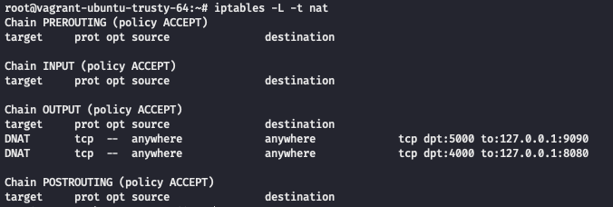

# HTTP Disruption POC

## About

This repository serves as a proof-of-concept for causing HTTP/HTTPS disruption by using a transparent proxy to drop or mangle requests based off of certain criteria. 

## Getting Started

### Dependencies

- [Go v1.16](https://golang.org/doc/install)
- [mkcert](https://kifarunix.com/how-to-create-self-signed-ssl-certificate-with-mkcert-on-ubuntu-18-04/)

### Environment

This proof-of-concept used a virtual machine running Ubuntu 18.04 in a Virtual Box hypervisor with 2 CPUs and 2GB of memory. The virtual machine setup can be replicated using the `Vagrantfile` in this repository. Go v1.16 was used.

### Creating the Certificates

```bash
mkcert -install
mkcert localhost 127.0.0.1 google.com *.google.com projectreclass.org *.projecreclass.org
```

### Creating IP Table Rules

```bash
iptables -t nat -A OUTPUT -p tcp -m tcp --dport 5000 -j DNAT --to-destination 127.0.0.1:9090
iptables -t nat -A OUTPUT -p tcp -m tcp --dport 4000 -j DNAT --to-destination 127.0.0.1:8080
```



## Running

In `main.go` update the `certFile` and `keyFile` variables to point to the correct certificates created in the previous step.

To start the application run...

```bash
go run main.go

# 2021/07/11 20:47:53 Starting TLS server on :9090
# 2021/07/11 20:47:53 Starting HTTP server on :8080
```

Once the server has started, you can make the requests using `curl`

```bash
curl https://google.com:5000 # remember to add port 5000 to HTTPS request
curl http://google.com:4000 # and port 4000 to HTTP requests
```

Post requests will be dropped

```bash
curl -X POST https://google.com:5000

# 2021/07/11 20:51:26 DROPPING REQUEST TO google.com/
```


